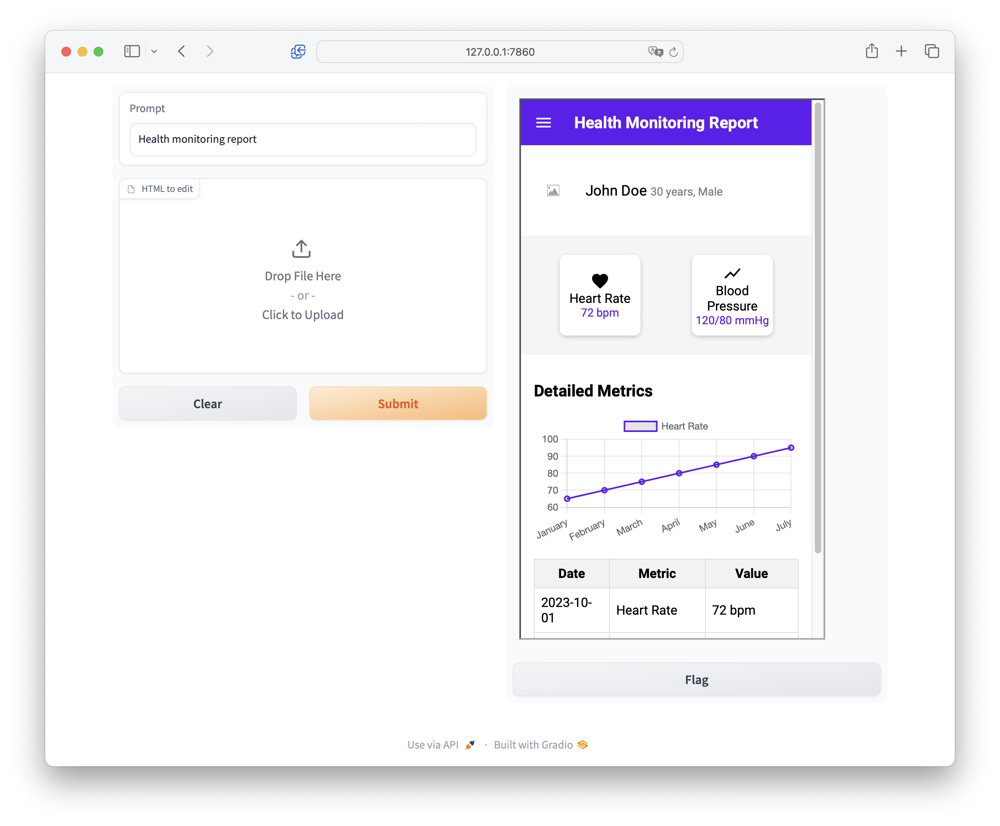

# AI-Gen-UI

## Getting Started

1. Install `poetry` (https://python-poetry.org/docs/#installation)

2. Install dependencies
```bash
poetry install
```

3. Set the environment variable
```bash
export OPENAI_API_KEY=your_openai_api_key
```

## Usage

### UI Generation with Large Language Model

1. Launch the LLM demo
```
python llm_demo.py
```

2. Open `http://127.0.0.1:7860` in your web browser

3. In the textbox, enter your page description and click the "Submit" button

4. You can also upload an HTML file and edit it by providing instructions in the textbox, such as "remove the footer of the page"




### UI Generation with Diffusion Model

1. Launch the DM demo
```
python dm_demo.py
```

2. Open `http://127.0.0.1:7860` in your web browser

3. In the textbox, enter your page description and click the "Submit" button


Our UI-Diffuser-v2 model is available at https://huggingface.co/Jl-wei/ui-diffuser-v2

## Citation
If you find our work useful, please cite our paper:
```bibtex
@misc{wei2024aiinspired,
      title={On AI-Inspired UI-Design}, 
      author={Jialiang Wei and Anne-Lise Courbis and Thomas Lambolais and Gérard Dray and Walid Maalej},
      year={2024},
      eprint={2406.13631},
      archivePrefix={arXiv}
}
```
Please note that the code and model can only be used for academic purpose.

