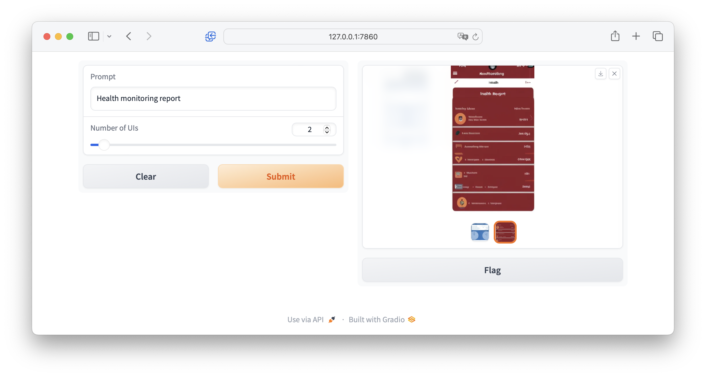

# AI-Gen-UI

## Getting Started

1. Install `poetry` (https://python-poetry.org/docs/#installation)

2. Install dependencies
```bash
poetry install
```

3. Set the environment variable
```bash
export OPENAI_API_KEY=your_openai_api_key
```

## Usage

### GUI Generation with Large Language Model

1. Launch the LLM demo
```
python llm_demo.py
```

2. Open `http://127.0.0.1:7860` in your web browser

3. In the textbox provided, enter your page description and click the "Submit" button

4. You can also upload an HTML file and edit it by providing instructions in the textbox, such as "remove the footer of the page"


### GUI Generation with Diffusion Model

1. Launch the DM demo
```
python dm_demo.py
```

2. Open `http://127.0.0.1:7860` in your web browser

3. In the textbox provided, enter your page description and click the "Submit" button


